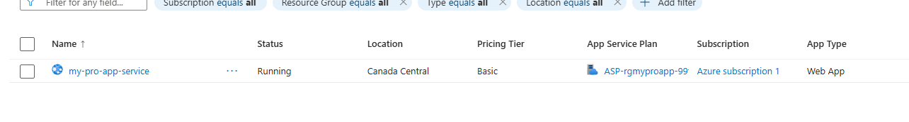
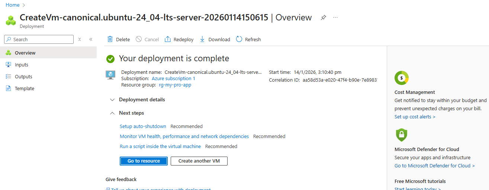

# Azure Infrastructure Deployment: Step-by-Step Lab

This project documents the manual creation and configuration of cloud infrastructure on Microsoft Azure. It covers the deployment of a managed web environment (PaaS) and a raw Linux server (IaaS) within a unified ecosystem.

---

## 🏗️ Step 1: Resource Group Creation
The foundation of any Azure project is the **Resource Group**. This acts as a logical container to manage the lifecycle of all related services.
* **Action:** Created `rg-my-pro-app` in the **Central India** region.
* **Purpose:** To ensure all compute, network, and storage assets are organized and managed together.

---

## 🌐 Step 2: Managed App Service Setup (PaaS)
The App Service provides a ready-to-use platform for hosting applications without the need to manage the underlying server or hardware.
* **Configuration:**
    * **Runtime Stack:** Node.js 24-LTS.
    * **Operating System:** Linux.
    * **Plan:** Basic B1 (Standard App Service Plan).
* **Result:** Azure automatically provisions the environment, allowing for immediate application hosting.

---

## 🖥️ Step 3: Virtual Machine Provisioning (IaaS)
To gain full administrative control, a Virtual Machine (VM) was deployed. This allows for total customization of the operating system.
* **OS Image:** Ubuntu 24.04 LTS (Noble Numbat).
* **Size:** Standard D2s v3 (2 vCPUs, 8 GiB memory).
* **Security:** Configured using an **SSH Public Key** for secure, passwordless terminal access.

---

## 🐚 Step 4: Ubuntu OS Configuration
Once the VM was "Running," I accessed the server via **SSH** to perform essential system administration tasks.
* **System Updates:** Executed `sudo apt update && sudo apt upgrade -y` to synchronize package indexes and install the latest security patches.
* **Environment Prep:** Successfully verified the connection and prepared the OS for the installation of production runtimes.

---

## 🧠 Conclusion & Knowledge Gained
1. **PaaS vs IaaS:** Identified the use cases for **App Service** (abstracted management) versus **Virtual Machines** (granular control).
2. **Cloud Resource Management:** Mastered the process of provisioning resources within specific subscriptions and regions.
3. **Linux Administration:** Gained hands-on experience managing a remote Ubuntu server via the command line interface.

---
**Architected by [HSRIPADARAO1108](https://github.com/HSRIPADARAO1108)**
